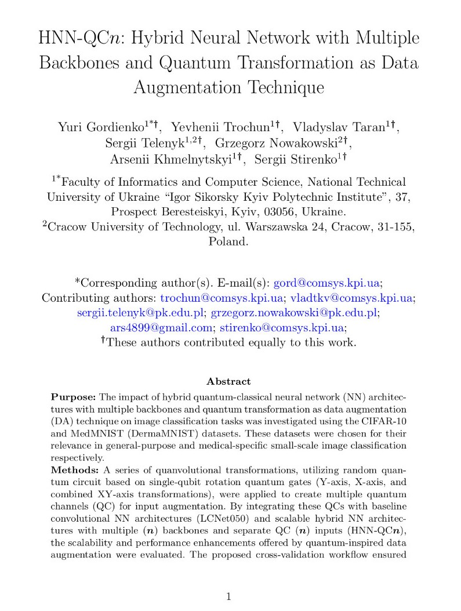
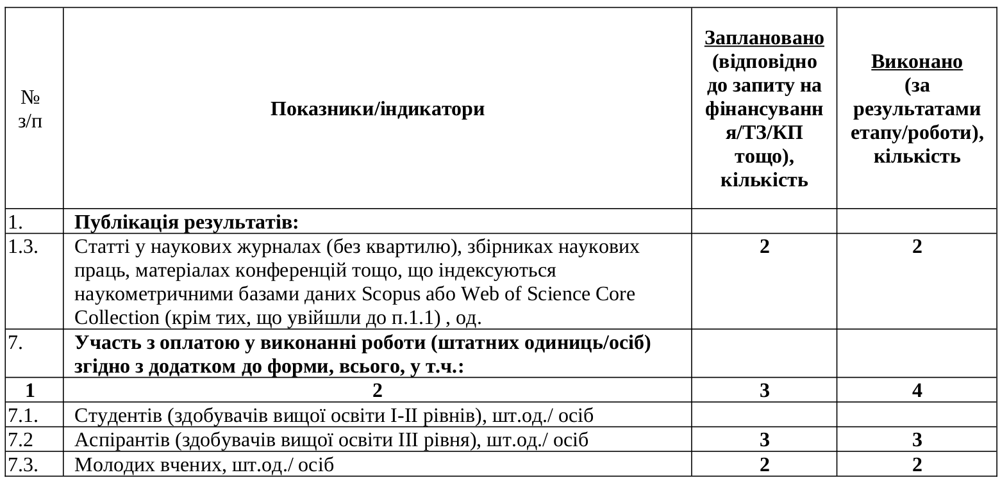

class: middle, center
 
.larger.success[Методи і програмні засоби управління безпілотними літальними апаратами при ройовому застосуванні на основі
штучного інтелекту] 

.smaller-x[Результати виконання держбюджетної науково-дослідної роботи] 
Тема д/б НДР: 2715 р

 
.bold.larger-x[Річний звіт]  
.larger[Період звітності: 01.01.2024 &mdash; 31.12.2024]  
.left[Науковий керiвник 
.bold[Таран Владислав Ігорович], PhD]  
  
 2024

---

class: middle,
# Зміст

- Основні наукові результати
- Основні практичні результати
- Порівняльна таблиця показників: заплановано/отримано
- Інноваційна складова
- Ступінь готовності розробки до виходу на ринок
- Перспективи розвитку проєкту

---

class: blue-slide, middle, center
count: false

.larger-xx[Основні наукові результати]

  
Підготовлено до публікації дві наукові статті

---

class: middle, center

.width-65[]

---

class: middle, center

.width-65[]

---

class: middle,
## Наукова цінність і актуальність отриманих результатів

- Досліджено відкриті академічні набори даних, такі як UAV123, UAV20L, UAVDT,
Drone Dataset (UAV), NTUT 4K Drone Photo, DAC-SDC, UAVid, MAVLab Dataset,
AID (Aerial Image Dataset), VisDrone2019-DET. Ці набори мають подекуди дуже обмежену вибірку, не покривають усіх потреб та доступні лише для
цивільного використання.

- Це робить їх обмежено придатними для навчання моделей ШІ під
спеціалізовані задачі. Як результат є висока потреба у розробці спеціалізованих
наборів даних для задач застосування БпЛА включно із їх ройовими
операціями. Враховуючи вищесказане був розроблений спеціалізований набір
даних пов’язаний із оборонною тематикою.

---

class:  middle
# Підготовлений набір даних

.grid[
.kol-1-2[
.bold.smaller.center[Відео]

.bold.larger-xx.center[52]

]

.kol-1-2[
.bold.smaller.center[Треків]

.bold.larger-xx.center[456]

]]
  
.grid[
.kol-1-2[
.bold.smaller.center[Об'єктів]

.bold.larger-xx.center[131 525]

]

.kol-1-2[
.bold.smaller.center[Унікальних міток]

.bold.larger-xx.center[13]

]
]

---

class:  middle
# Статистика

- Person military: 67981 анотованих об'єктів
- Person civil: 16176 анотованих об'єктів
- Vehicle civil car: 14011 анотованих об'єктів
- Tank: 13229 анотованих об'єктів
- APV: 11743 анотованих об'єктів
- Vehicle military: 2815 анотованих об'єктів
- Artillery system: 2092 анотованих об'єктів
- AAWS: 1879 анотованих об'єктів
- Vehicle civil truck: 826 анотованих об'єктів
- Fuel tank: 497 анотованих об'єктів
- Missile: 164 анотованих об'єктів
- MLRS: 74 анотованих об'єктів
- UAV: 38 анотованих об'єктів

---

class: blue-slide, middle, center
count: false

.larger-xx[Основні практичні результати]

---
class:  middle
## Практична цінність результатів для потреб оборони, безпеки, економіки та/або суспільства України

- Підготовлений спеціалізований набір даних можна використовувати для
створення автоматизованих методів експлуатації БпЛА на основі штучного інтелекту: автономного
розпізнавання об’єктів на відео в режимі реального часу під час виконання завдань навігації, моніторингу довкілля, захоплення цілі, розвідки.

- Це особливо важливо для створення автономних систем, які повинні супроводжувати ціль, уникати перешкоди
і взаємодіяти з навколишнім середовищем без участі або з мінімальною участю оператора.

---

class: blue-slide, middle, center
count: false

.larger-xx[Порівняльна таблиця показників: заплановано/отримано]

---

class: middle, center

## Основні кількісні показники/індикатори виконання звітного етапу за темою роботи

.width-100[]

---

class: blue-slide, middle, center
count: false

.larger-xx[Інноваційна складова]

---

class: middle,
## Унікальність даних

- .smaller-x[Набір містить відеозаписи, які зроблені з БпЛА в різних умовах (день, ніч, туман, дим, дощ, сніг), з різними типами об’єктів (Person military, Person
civil, Tank, APV, Artillery system, MLRS, AAWS, Aircraft, Helicopter, UAV, Warship, Boat, Vehicle military, Vehicle civil truck, Vehicle civil car, Fuel tank, Special
equipment, Cruise missile, Missile) для різних ландшафтів (міста, села, промислові зони, поля, фермерські угіддя, ліси, річки, море) та з урахуванням реальних сценаріїв (завдання розвідки, моніторингу, навігації).]

- .smaller-x[Використання набору забезпечує можливість навчання моделей для складних умов застосування: погані погодні
умови або освітлення, перешкоди у вигляді рослинності, будівель тощо.]

## Підтримка стандартів обміну даними

- .smaller-x[Набір даних відповідає сучасним стандартам анотацій (YOLO, Pascal VOC, COCO), що робить його сумісним із популярними бібліотеками та фреймворками машинного навчання.]

---

class: blue-slide, middle, center
count: false

.larger-xx[Ступінь готовності розробки до виходу на ринок]

---

class: middle,

.larger-x[На сьогодні виконано 1 з 3 запланованих етапів проєкту, що становить приблизно 33% від загального обсягу робіт.]

---

class: blue-slide, middle, center
count: false

.larger-xx[Перспективи розвитку проєкту]

---

class: middle,

Перспективи розвитку підготовленого набору даних у контексті автоматизації, масштабування та покращення якості даних можна розглянути через такі стратегій:

 - Застосування моделей ШІ, навчених на зображеннях у подібних умовах, для автоматизованої допомоги в анотації.
 - Залучення досвідчених лейблерів із відповідними навичками для масштабування набору даних та ефективної роботи з складними випадками, такими як погане освітлення, складні ландшафти чи об'єкти.
 - Додавання нових зразків з реальних умов використання для рідкісних класів.

---

class: end-slide, center
count: false

.larger-xxxx[🏁]