class: middle, center
 
.larger.success[Методи і програмні засоби управління безпілотними літальними апаратами при ройовому застосуванні на основі
штучного інтелекту] 

.smaller-x[Результати виконання держбюджетної науково-дослідної роботи] 
Тема д/б НДР: 2715 р

 
.bold.larger-x[Річний звіт]  
.larger[Період звітності: 01.01.2024 &mdash; 31.12.2024]  
.left[Науковий керiвник 
.bold[Таран Владислав Ігорович], PhD]  
  
 2024

---

class: middle,
# Зміст

- Пошук, збір та аналіз наявних даних придатних для застосування у БпЛА
- Обробка та маркування спеціалізованих наборів даних
- Інтеграція процесу підготовки даних
- Підготовка набору даних

---

class:  middle, center
count: false

.larger-x[Пошук, збір та аналіз наявних даних придатних для застосування у БпЛА]

---

class:  middle
## Робочий процес для збору, підготовки та обробки даних
.center[
.width-90[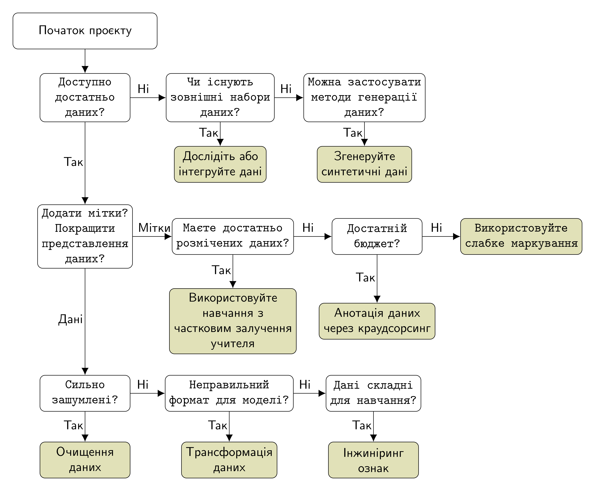]
]

---

class:  middle
## Загальна характеристика наборів даних

.larger-x[
| *Тип набору даних *             | *Переваги *               | *Недоліки*                 |
|------------------------|---------------------------------------------------|----------------------------------------|
| Навчальний (академічний) | Зрозумілі дані, прості у використанні         | Обмежена вибірка, надто спрощена, результати не завжди переносяться на реальні умови |
| Турнірний       | Дані близькі до реальних  | Усе ще спрощені дані та доступні лише для гарячих тем, результати не завжди переносяться на реальні умови |
| Первинні дані | Висока гнучкість | Для підготовки потрібно багато зусиль |
]

- Академічні набори даних не можуть задовільнити усі потреби розробників для досягнення високої якості моделі, яку б можна було розгорнути у робочий процес.
- На даний момент відсутні відкриті академічні та турнірні набори даних, які  пов’язані зі збором даних  з БпЛА в реальних умовах під час виконання бойових, розвідувальних завдань на полі бою або у тилу ворога.
---

class:  middle
# Синтетичні дані

Коли відсутні зовнішні набори даних, можна скористатись генеративними методами для отримання синтетичних даних, проте цей підхід має кілька суттєвих недоліків, через які не завжди його можна брати за основу:

- *Недостатня реалістичність.* Синтетичні дані можуть не завжди  добре відповідати реальним даним. Це може призвести до того, що модель, побудована на синтетичних даних, не буде ефективно працювати у реальних умовах.
- *Неадекватність генерації.* Генерація синтетичних даних може бути складною задачею і не завжди може вдатись створити дані, які б відображали усі можливі аспекти реальних даних.
- *Недостатність репрезентативності.* Синтетичні дані не завжди можуть відобразити усю різноманітність та складність реальних даних, що може призвести до виникнення проблем при застосуванні моделі на реальних даних.
- *Вартість створення.* Генерація синтетичних даних може вимагати значних витрат, особливо якщо потрібно створити дані, які точно відображають конкретні сценарії або умови.

---

class:  middle
# Первинні дані
.bold[Первиннi данi] &mdash; це набiр ознак у справжнiй формi збору, часто такi данi є неструктурованими. 

Справжня форма збору даних означає, що навчена модель штучного інтелекту після розгортання її у виробничому процесі буде приймати на вхід дані  у такому ж форматі, що й були зібрані для навчання. Це забезпечить основу для досягнення високої гнучкості та якості моделі у майбутньому.

- Тому єдиним логічним кроком на цьому етапі був пошук первинних даних отриманих у військових умовах за допомогою дронів з повітря для різних висот, погодних умов, освітлення, ландшафту,  різних видів військової техніки тощо. 

- Для виконання цього завдання нами було досліджено відкриті  джерела: групи та канали на платформах соціальних мереж та  крос-платформових системах миттєвого обміну повідомленнями (Facebook, YouTube, WhatsApp, Instagram, Telegram), платформа для змагань з науки про дані (kaggle), paperswithcode, платформа для розробників (github).

---

class: blue-slide, middle, center
count: false

.larger-xx[Первинні дані]

.larger-x[Приклади зібраних даних]

.larger[Нами було зібрано понад 247 відео, які відзнято з БпЛА за допомогою оптичної камери та понад 55 відео &mdash; за  допомогою IR-камери.]

---

class: middle, center, black-slide
.footnote[Джерело: [https://t.me/ssternenko/12987](https://t.me/ssternenko/12987)]

<video width="600" height="450" controls muted>
    <source src="figures/IMG_6473.MP4" type="video/mp4">
</video>

---

class: middle, center, black-slide
.footnote[Джерело: [https://www.youtube.com/watch?v=n4wEJ-wcGWE]( https://www.youtube.com/watch?v=n4wEJ-wcGWE)]

<iframe width="600" height="450" src="https://www.youtube.com/embed/n4wEJ-wcGWE?mute=1" frameborder="0" allowfullscreen></iframe>

---

class: middle, center, black-slide
.footnote[Джерело: [https://t.me/DeepStateUA/12307](https://t.me/DeepStateUA/12307)]

<video width="600" height="450" controls muted>
    <source src="figures/video_2022-05-02_09-56-36.mp4" type="video/mp4">
</video>

---

class: middle, center, black-slide
.footnote[Джерело: [https://t.me/ssternenko/14284](https://t.me/ssternenko/14284)]

<video width="600" height="450" controls muted>
    <source src="figures/IMG_8394.MOV" type="video/mp4">
</video>

---

class:  middle, center
count: false

.larger-x[Обробка та маркування спеціалізованих наборів даних]

---

class:  middle
## Передумови для створення високоякісного набору даних
 
.center[
.width-95[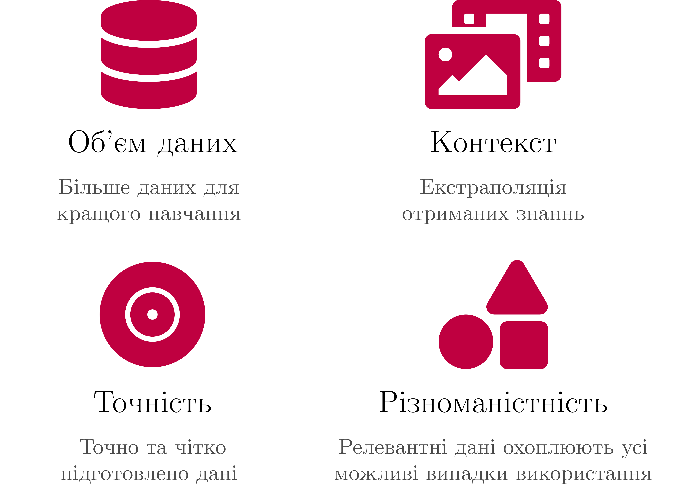]
]

---

class:  middle
## Ключові складові для організації високоякісної підготовки даних
  
.center[
.width-100[]
]

  
- .smaller-x[Високопродуктивний конвеєр анотації даних вимагає стратегічного поєднання робочої сили з технічними знаннями, інструментами та операціями, які зможуть забезпечити високу якість підготовлених даних.]

---

class:  middle
# Активне навчання
.center[
.width-75[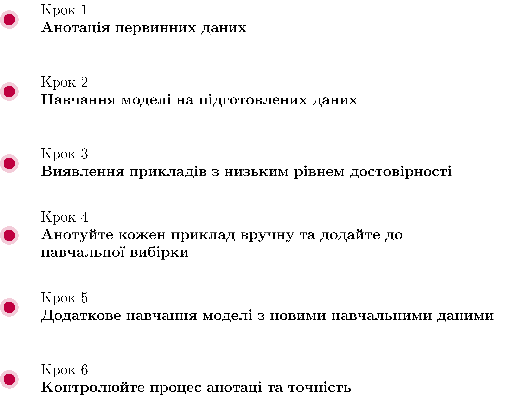]
]

- .smaller-x[Цей метод дозволяє значно зменшити вартість та об’єм даних, які потрібно анотувати вручну, зберігаючи при цьому високу точність моделі.]

---

class:  middle
# Типові помилки анотації

- .bold[Нарисований прямокутник для повністю перекритого об'єкта.] Якщо об'єкт повністю перекритий, то обмежувальну рамку не рисуємо.

.grid[
.kol-1-2[
.width-100[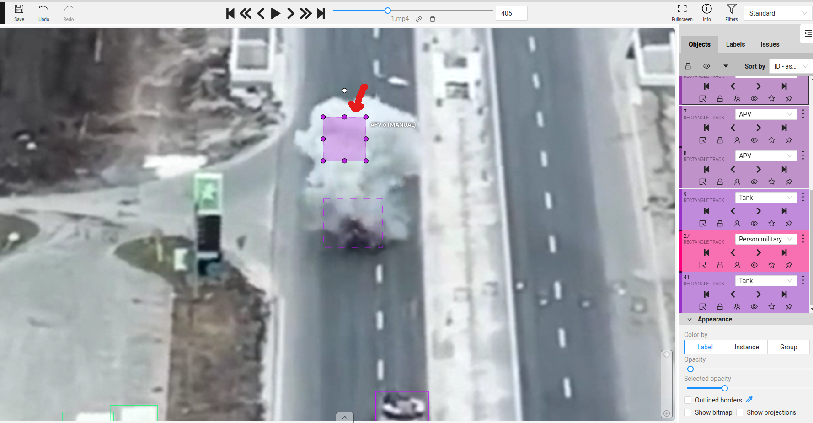]

]

.kol-1-2[.width-100[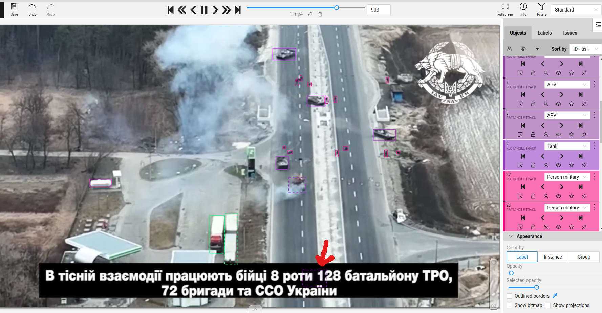]

  ]
]

---

class:  middle
# Типові помилки анотації

-  .bold[Не включено occluded.] Якщо частина об'єкта знаходиться за кадром або чимось перекрита потрібно це вказати, тобто включити для цього прямокутника властивість occluded.

.center[
.width-45[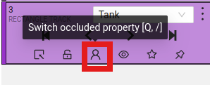]
.width-75[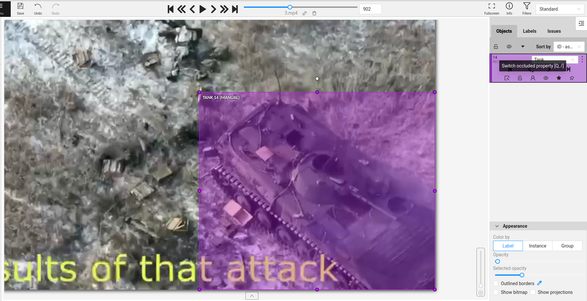]
]

---

class:  middle
# Типові помилки анотації

-  .bold[Один і той же об'єкт має різні індекси.] Якщо ми розуміємо, що один і той же об'єкт виходить за межі екрану або повністю перекривається іншим предметом і потім знову з'являється у полі зору, то такий об'єкт має бути розмічений як один, тобто цей об’єкт повинен мати однаковий індекс. Для об’єднання потрібно скористатись функцією Merge.

---

class:  middle
# Типові помилки анотації

-  .bold[Розмічено лише частину об'єкта] 

.center.grid[
.kol-1-2[
.width-100[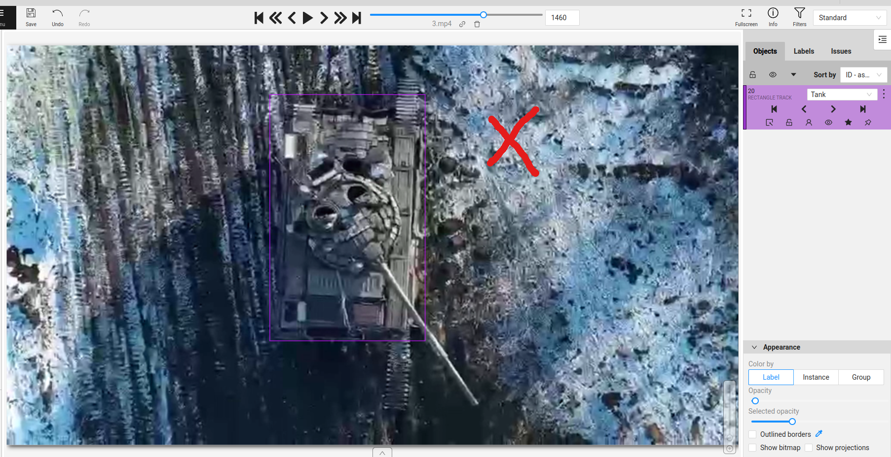]

Неправильно

]

.kol-1-2[.width-100[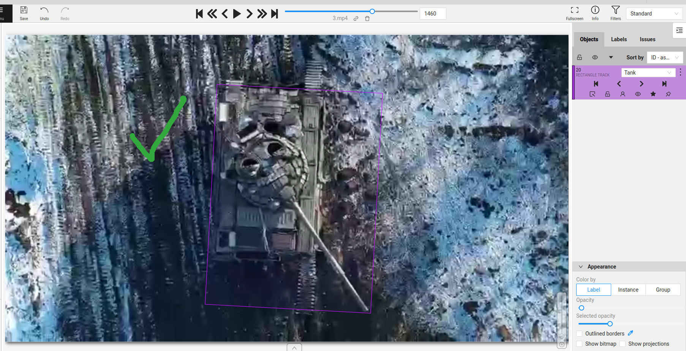]

Правильно

  ]
]

---

class:  middle
# Типові помилки анотації

-  .bold[Нерелевантні кадри не видалено.] Фрагменти відеоконтенту, який не відноситься до зйомки з БпЛА або на якому відсутні визначені класи об'єктів потрібно видаляти: Alt + Del

---

class:  middle
# Типові помилки анотації

-  .bold[Зміщені або неправильного розміру прямокутники.] Об'єкт має повністю потрапити у прямокутник, водночас цей прямокутник має був трохи  більшим на 1-2 пікселі за розмір об'єкта, який розмічаємо.

.center[
.width-85[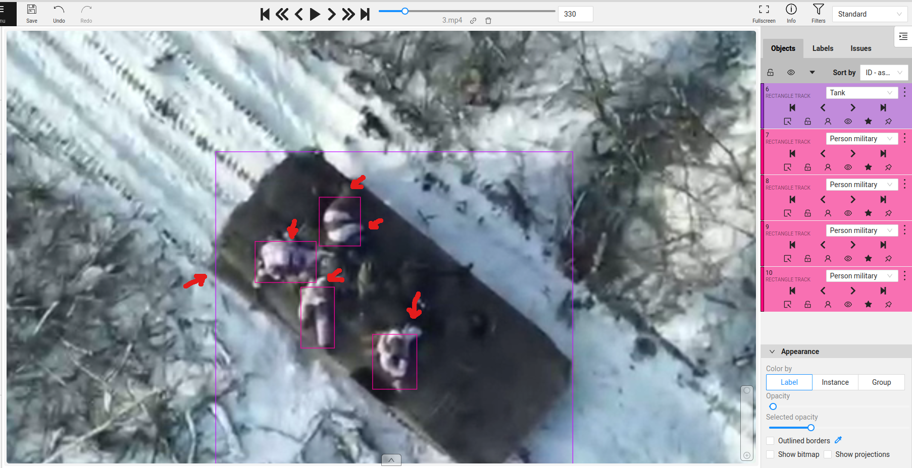]
]

---

class:  middle, center
count: false

.larger-x[Інтеграція процесу підготовки даних]

---

class:  middle
# CVAT

.center[
.width-95[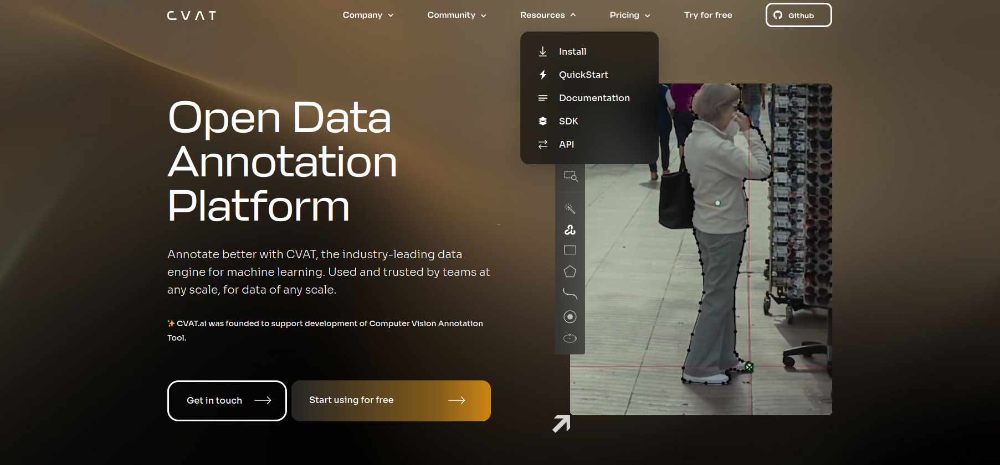]
]

- Для централізованого зберігання знімків з сенсорів БпЛА, попередньої обробки зображень, створення наборів даних із ручною або автоматизованою розміткою ми використовували
Computer Vision Annotation Tool (CVAT).

---

class:  middle
# CVAT

.center[
.width-95[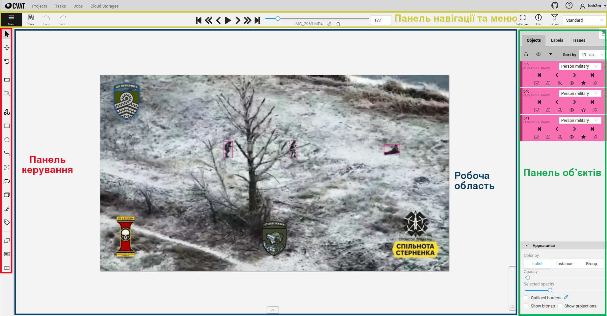]
]

- Має зручний простий інтерфейс.
- Пропонує легку інтеграцію з сучасними технологіями: можна імпортувати й експортувати анотації в популярних форматах, таких як YOLO, COCO, Pascal, VOC тощо.

---

class:  middle, center
count: false

.larger-x[Підготовка набору даних]

---

class:  middle
#   Класи (об’єкти інтересу)
.center[
.width-75[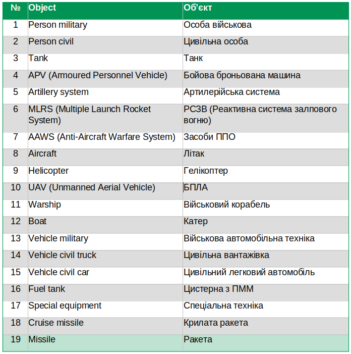]
]

---

class:  middle
#   Класи (об’єкти інтересу)
.center[
.width-100[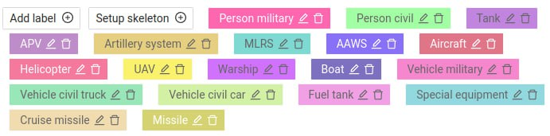]
]

---

class:  middle
#   Підготовлений набір даних

.grid[
.kol-1-2[
.bold.smaller.center[Відео]

.bold.larger-xx.center[52]

]

.kol-1-2[
.bold.smaller.center[Треків]

.bold.larger-xx.center[456]

]]
  
.grid[
.kol-1-2[
.bold.smaller.center[Об'єктів]

.bold.larger-xx.center[131 525]

]

.kol-1-2[
.bold.smaller.center[Унікальних міток]

.bold.larger-xx.center[13]

]
]

---

class:  middle
# Статистика

- Person military: 67981 анотованих об'єктів
- Person civil: 16176 анотованих об'єктів
- Vehicle civil car: 14011 анотованих об'єктів
- Tank: 13229 анотованих об'єктів
- APV: 11743 анотованих об'єктів
- Vehicle military: 2815 анотованих об'єктів
- Artillery system: 2092 анотованих об'єктів
- AAWS: 1879 анотованих об'єктів
- Vehicle civil truck: 826 анотованих об'єктів
- Fuel tank: 497 анотованих об'єктів
- Missile: 164 анотованих об'єктів
- MLRS: 74 анотованих об'єктів
- UAV: 38 анотованих об'єктів

---

class:  middle
.center[
.width-100[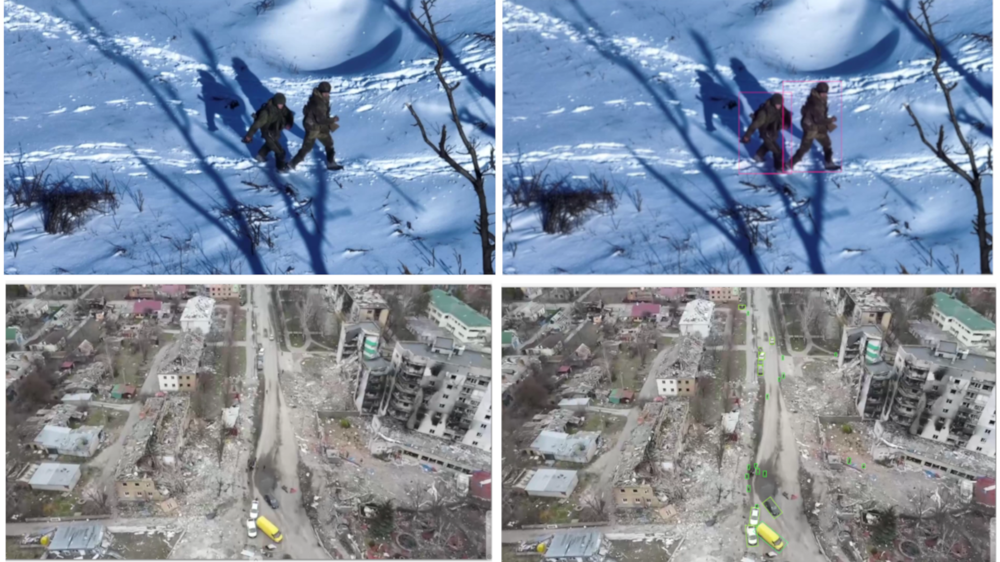]
]

---

class:  middle
.center[
.width-100[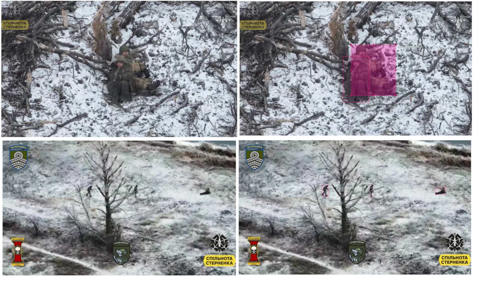]
]

---

class:  middle
.center[
.width-100[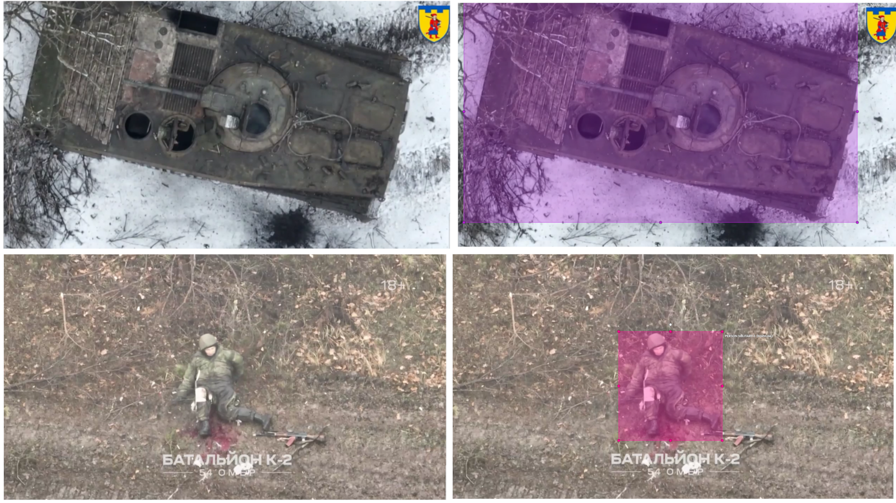]
]

---

class: middle, center, black-slide

<video width="600" height="450" controls muted>
    <source src="figures/Kazam_screencast_00000.mp4" type="video/mp4">
</video>

---

class: middle, center, black-slide

<video width="600" height="450" controls muted>
    <source src="figures/Kazam_screencast_00001.mp4" type="video/mp4">
</video>

---

class: end-slide, center
count: false

.larger-xxxx[🏁]